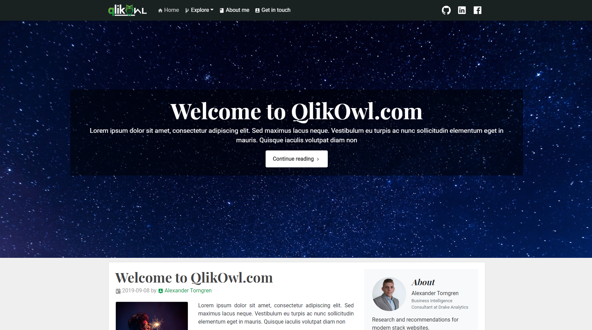
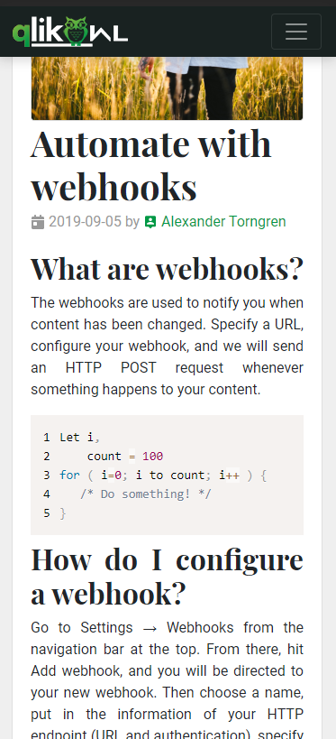
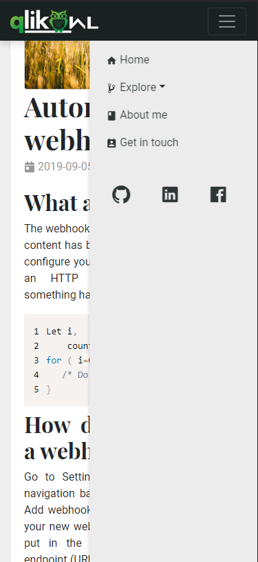

# Qlik Owl

<div align="center">

> A blog about my journey with BI, Qlik and development, moving towards cloud and SAAS.
>
> This web app is powered by **_[React](https://reactjs.org)_**  and **_[create-react-app](https://create-react-app.dev)_** [![Create React App @ NPM]][npm-image][npm-url]

[![Netlify Status][netlify-img]][netlify-url]
[![Github Tag][tag-img]][tag-url]
[![NPM Dependency Status][pkg_img]][pkg_url]
[![Website Status][web-img]][web-url]

[![Check It Out][check-it-out]][web-url][][web-url][][web-url]

---



 

</div>

---

## Get started

```bash
> git clone https://github.com/alexandertorngren/qlikowl.com.git

> cd ./qlikowl.com

> npm install

# When the installation is done, run this to start the server
> npm start
# Server running on http://localhost:3000
```

## Available Scripts

In the project directory, you can run:

### `npm start`

Runs the app in the development mode.<br>
Open [http://localhost:3000](http://localhost:3000) to view it in the browser.

The page will reload if you make edits.<br>
You will also see any lint errors in the console.

### `npm format`

Runs Prettier to clean the code.

### `npm test`

Launches the test runner in the interactive watch mode.<br>
See the section about [running tests](https://facebook.github.io/create-react-app/docs/running-tests) for more information.

### `npm run build`

Builds the app for production to the `build` folder.<br>
It correctly bundles React in production mode and optimizes the build for the best performance.

The build is minified and the filenames include the hashes.<br>
Your app is ready to be deployed!

See the section about [deployment](https://facebook.github.io/create-react-app/docs/deployment) for more information.

### `npm run eject`

**Note: this is a one-way operation. Once you `eject`, you can’t go back!**

If you aren’t satisfied with the build tool and configuration choices, you can `eject` at any time. This command will remove the single build dependency from your project.

Instead, it will copy all the configuration files and the transitive dependencies (Webpack, Babel, ESLint, etc) right into your project so you have full control over them. All of the commands except `eject` will still work, but they will point to the copied scripts so you can tweak them. At this point you’re on your own.

You don’t have to ever use `eject`. The curated feature set is suitable for small and middle deployments, and you shouldn’t feel obligated to use this feature. However we understand that this tool wouldn’t be useful if you couldn’t customize it when you are ready for it.

## Release History

- 0.1.5
  - CHANGE: Implementing Contentful and Netlify
- 0.2.0
  - CHANGE: Continuing to develop the framework, working with props and layout
- 0.2.5
  - CHANGE: Added scroll handler, fixed css, changed featured posts and much more

## Meta

Alexander Torngren - [QlikOwl.com][web-url]

Distributed under the [![License][license-img]][license-url]. See [LICENSE][license-url] for more information.

[https://github.com/yourname/github-link](https://github.com/dbader/)

## Contributing

1. [Fork it][fork-url]
2. Create your feature branch `$ git checkout -b feature/fooBar`
3. Commit your changes `$ git commit -am 'Add some fooBar'`
4. Push to the branch: `$ git push origin feature/fooBar`
5. Create a new Pull Request

<!-- Markdown link & img dfn's -->

[commit-img]: https://img.shields.io/github/last-commit/alexandertorngren/qlikowl.com?style=flat-square
[license-img]: https://img.shields.io/github/license/alexandertorngren/qlikowl.com?style=flat-square
[license-url]: https://github.com/alexandertorngren/qlikowl.com/blob/master/LICENSE
[fork-url]: https://github.com/alexandertorngren/qlikowl.com/fork/
[tag-img]: https://img.shields.io/github/package-json/v/alexandertorngren/qlikowl.com?style=flat-square
[tag-url]: https://github.com/alexandertorngren/qlikowl.com
[pkg_img]: https://img.shields.io/david/alexandertorngren/qlikowl.com?style=flat-square
[pkg_url]: https://david-dm.org/alexandertorngren/qlikowl.com
[npm-img]: https://img.shields.io/npm/v/create-react-app?style=flat-square
[npm-url]: https://www.npmjs.com/package/create-react-app
[netlify-img]: https://api.netlify.com/api/v1/badges/fb30cf44-6f5e-4ab7-9c55-501985ea0dc6/deploy-status?style=flat-square
[netlify-url]: https://app.netlify.com/sites/qlikowl/deploys
[web-img]: https://img.shields.io/website/http/qlikowl.netlify.com?down_color=lightgrey&down_message=offline&style=flat-square&up_color=blue&up_message=online
[web-url]: https://qlikowl.com
[check-it-out]: https://forthebadge.com/images/badges/check-it-out.svg
[netlify-img]: https://api.netlify.com/api/v1/badges/fb30cf44-6f5e-4ab7-9c55-501985ea0dc6/deploy-status?style=flat-square
[netlify-url]: https://app.netlify.com/sites/qlikowl/deploys
